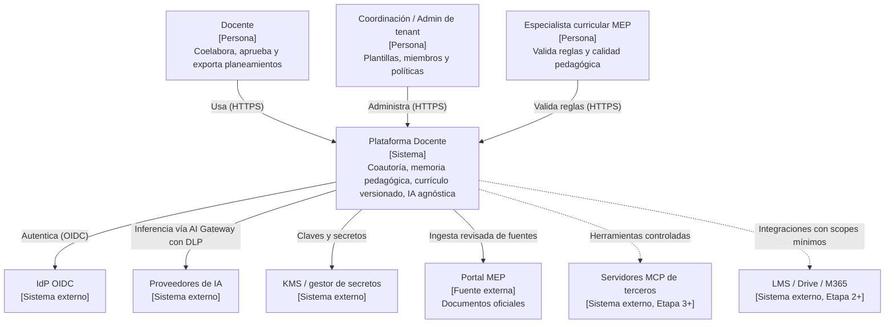

# C4 L1 — System Context

Fuente: [04 §3](../04-Software-Architecture.md). Notación C4 representada con un flowchart de Mermaid (personas, sistema y sistemas externos).

```mermaid
flowchart TB
  teacher["Docente<br/>[Persona]<br/>Coelabora, aprueba y exporta planeamientos"]
  coord["Coordinación / Admin de tenant<br/>[Persona]<br/>Plantillas, miembros y políticas"]
  expert["Especialista curricular MEP<br/>[Persona]<br/>Valida reglas y calidad pedagógica"]

  platform["Plataforma Docente<br/>[Sistema]<br/>Coautoría, memoria pedagógica, currículo versionado, IA agnóstica"]

  idp["IdP OIDC<br/>[Sistema externo]"]
  llm["Proveedores de IA<br/>[Sistema externo]"]
  kms["KMS / gestor de secretos<br/>[Sistema externo]"]
  mep["Portal MEP<br/>[Fuente externa]<br/>Documentos oficiales"]
  mcp["Servidores MCP de terceros<br/>[Sistema externo, Etapa 3+]"]
  lms["LMS / Drive / M365<br/>[Sistema externo, Etapa 2+]"]

  teacher -->|"Usa (HTTPS)"| platform
  coord -->|"Administra (HTTPS)"| platform
  expert -->|"Valida reglas (HTTPS)"| platform
  platform -->|"Autentica (OIDC)"| idp
  platform -->|"Inferencia vía AI Gateway con DLP"| llm
  platform -->|"Claves y secretos"| kms
  platform -->|"Ingesta revisada de fuentes"| mep
  platform -.->|"Herramientas controladas"| mcp
  platform -.->|"Integraciones con scopes mínimos"| lms
```
