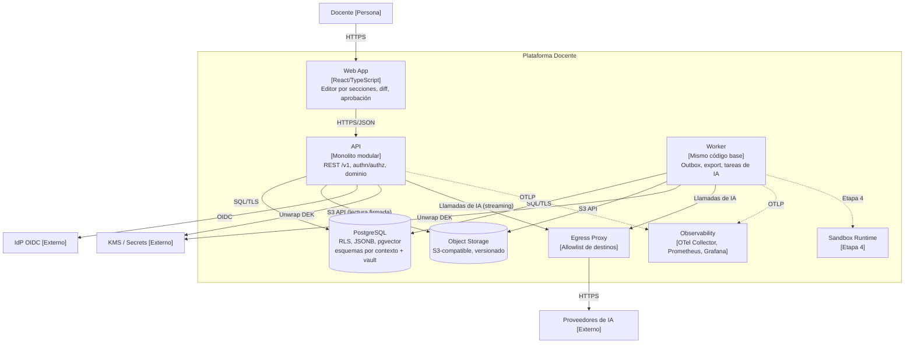

# C4 L2 — Containers

Fuente: [04 §4](../04-Software-Architecture.md). Línea discontinua = Etapa posterior al MVP.

```mermaid
flowchart TB
  teacher["Docente [Persona]"]

  subgraph platform["Plataforma Docente"]
    web["Web App<br/>[React/TypeScript]<br/>Editor por secciones, diff, aprobación"]
    api["API<br/>[Monolito modular]<br/>REST /v1, authn/authz, dominio"]
    worker["Worker<br/>[Mismo código base]<br/>Outbox, export, tareas de IA"]
    db[("PostgreSQL<br/>RLS, JSONB, pgvector<br/>esquemas por contexto + vault")]
    obj[("Object Storage<br/>S3-compatible, versionado")]
    egress["Egress Proxy<br/>[Allowlist de destinos]"]
    obs["Observability<br/>[OTel Collector, Prometheus, Grafana]"]
    sbx["Sandbox Runtime<br/>[Etapa 4]"]
  end

  idp["IdP OIDC [Externo]"]
  kms["KMS / Secrets [Externo]"]
  llm["Proveedores de IA [Externo]"]

  teacher -->|HTTPS| web
  web -->|"HTTPS/JSON"| api
  api -->|"SQL/TLS"| db
  worker -->|"SQL/TLS"| db
  worker -->|"S3 API"| obj
  api -->|"S3 API (lectura firmada)"| obj
  api -->|OIDC| idp
  api -->|"Unwrap DEK"| kms
  worker -->|"Unwrap DEK"| kms
  worker -->|"Llamadas de IA"| egress
  api -->|"Llamadas de IA (streaming)"| egress
  egress -->|HTTPS| llm
  api -.->|OTLP| obs
  worker -.->|OTLP| obs
  worker -.->|"Etapa 4"| sbx
```
