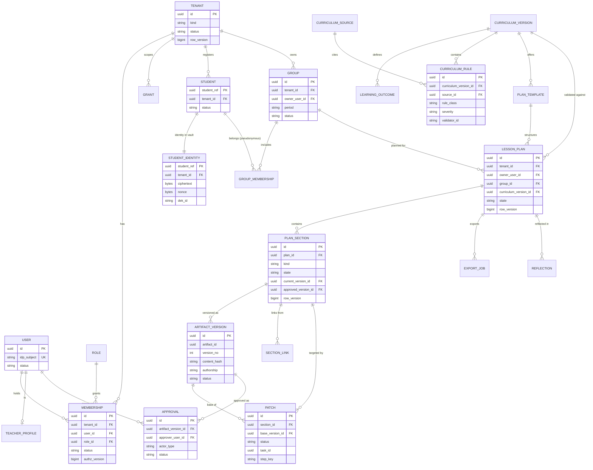

# ERD — Identidad, currículo, planeamiento y documentos

Fuente: [06 §3.1–3.3](../06-Data-Architecture.md). Solo columnas clave; el diccionario completo está en 06.

```mermaid
erDiagram
  TENANT ||--o{ MEMBERSHIP : has
  USER ||--o{ MEMBERSHIP : holds
  ROLE ||--o{ MEMBERSHIP : grants
  USER ||--o| TEACHER_PROFILE : is
  TENANT ||--o{ GRANT : scopes
  TENANT ||--o{ STUDENT : registers
  STUDENT ||--|| STUDENT_IDENTITY : "identity in vault"
  TENANT ||--o{ GROUP : owns
  GROUP ||--o{ GROUP_MEMBERSHIP : includes
  STUDENT ||--o{ GROUP_MEMBERSHIP : "belongs (pseudonymous)"
  CURRICULUM_VERSION ||--o{ LEARNING_OUTCOME : defines
  CURRICULUM_VERSION ||--o{ CURRICULUM_RULE : contains
  CURRICULUM_VERSION ||--o{ PLAN_TEMPLATE : offers
  CURRICULUM_SOURCE ||--o{ CURRICULUM_RULE : cites
  GROUP ||--o{ LESSON_PLAN : "planned for"
  CURRICULUM_VERSION ||--o{ LESSON_PLAN : "validated against"
  PLAN_TEMPLATE ||--o{ LESSON_PLAN : structures
  LESSON_PLAN ||--o{ PLAN_SECTION : contains
  PLAN_SECTION ||--o{ ARTIFACT_VERSION : "versioned as"
  PLAN_SECTION ||--o{ SECTION_LINK : "links from"
  PLAN_SECTION ||--o{ PATCH : "targeted by"
  ARTIFACT_VERSION ||--o{ PATCH : "base of"
  ARTIFACT_VERSION ||--o{ APPROVAL : "approved as"
  USER ||--o{ APPROVAL : approves
  LESSON_PLAN ||--o{ EXPORT_JOB : exports
  LESSON_PLAN ||--o{ REFLECTION : "reflected in"

  TENANT {
    uuid id PK
    string kind
    string status
    bigint row_version
  }
  USER {
    uuid id PK
    string idp_subject UK
    string status
  }
  MEMBERSHIP {
    uuid id PK
    uuid tenant_id FK
    uuid user_id FK
    uuid role_id FK
    string status
    bigint authz_version
  }
  STUDENT {
    uuid student_ref PK
    uuid tenant_id FK
    string status
  }
  STUDENT_IDENTITY {
    uuid student_ref PK
    uuid tenant_id FK
    bytes ciphertext
    bytes nonce
    string dek_id
  }
  GROUP {
    uuid id PK
    uuid tenant_id FK
    uuid owner_user_id FK
    string period
    string status
  }
  LESSON_PLAN {
    uuid id PK
    uuid tenant_id FK
    uuid owner_user_id FK
    uuid group_id FK
    uuid curriculum_version_id FK
    string state
    bigint row_version
  }
  PLAN_SECTION {
    uuid id PK
    uuid plan_id FK
    string kind
    string state
    uuid current_version_id FK
    uuid approved_version_id FK
    bigint row_version
  }
  ARTIFACT_VERSION {
    uuid id PK
    uuid artifact_id
    int version_no
    string content_hash
    string authorship
    string status
  }
  PATCH {
    uuid id PK
    uuid section_id FK
    uuid base_version_id FK
    string status
    uuid task_id
    string step_key
  }
  APPROVAL {
    uuid id PK
    uuid artifact_version_id FK
    uuid approver_user_id FK
    string actor_type
    string status
  }
  CURRICULUM_RULE {
    uuid id PK
    uuid curriculum_version_id FK
    uuid source_id FK
    string rule_class
    string severity
    string validator_id
  }
```
