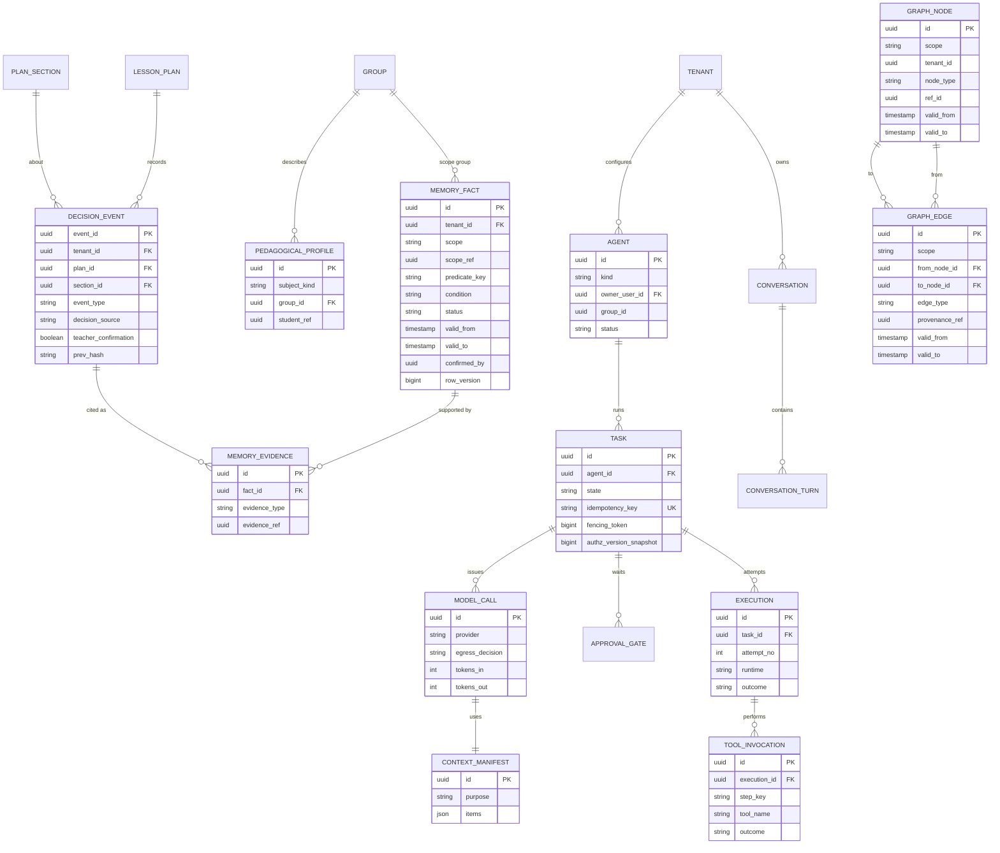

# ERD — Memoria, grafo, IA y agentes

Fuente: [06 §3.4–3.7](../06-Data-Architecture.md).

```mermaid
erDiagram
  TENANT ||--o{ CONVERSATION : owns
  CONVERSATION ||--o{ CONVERSATION_TURN : contains
  LESSON_PLAN ||--o{ DECISION_EVENT : records
  PLAN_SECTION ||--o{ DECISION_EVENT : "about"
  GROUP ||--o{ MEMORY_FACT : "scope group"
  MEMORY_FACT ||--o{ MEMORY_EVIDENCE : "supported by"
  DECISION_EVENT ||--o{ MEMORY_EVIDENCE : "cited as"
  GROUP ||--o{ PEDAGOGICAL_PROFILE : describes
  GRAPH_NODE ||--o{ GRAPH_EDGE : "from"
  GRAPH_NODE ||--o{ GRAPH_EDGE : "to"
  TENANT ||--o{ AGENT : configures
  AGENT ||--o{ TASK : runs
  TASK ||--o{ EXECUTION : attempts
  EXECUTION ||--o{ TOOL_INVOCATION : performs
  TASK ||--o{ APPROVAL_GATE : waits
  TASK ||--o{ MODEL_CALL : issues
  MODEL_CALL ||--|| CONTEXT_MANIFEST : "uses"

  DECISION_EVENT {
    uuid event_id PK
    uuid tenant_id FK
    uuid plan_id FK
    uuid section_id FK
    string event_type
    string decision_source
    boolean teacher_confirmation
    string prev_hash
  }
  MEMORY_FACT {
    uuid id PK
    uuid tenant_id FK
    string scope
    uuid scope_ref
    string predicate_key
    string condition
    string status
    timestamp valid_from
    timestamp valid_to
    uuid confirmed_by
    bigint row_version
  }
  MEMORY_EVIDENCE {
    uuid id PK
    uuid fact_id FK
    string evidence_type
    uuid evidence_ref
  }
  PEDAGOGICAL_PROFILE {
    uuid id PK
    string subject_kind
    uuid group_id FK
    uuid student_ref
  }
  GRAPH_NODE {
    uuid id PK
    string scope
    uuid tenant_id
    string node_type
    uuid ref_id
    timestamp valid_from
    timestamp valid_to
  }
  GRAPH_EDGE {
    uuid id PK
    string scope
    uuid from_node_id FK
    uuid to_node_id FK
    string edge_type
    uuid provenance_ref
    timestamp valid_from
    timestamp valid_to
  }
  AGENT {
    uuid id PK
    string kind
    uuid owner_user_id FK
    uuid group_id
    string status
  }
  TASK {
    uuid id PK
    uuid agent_id FK
    string state
    string idempotency_key UK
    bigint fencing_token
    bigint authz_version_snapshot
  }
  EXECUTION {
    uuid id PK
    uuid task_id FK
    int attempt_no
    string runtime
    string outcome
  }
  TOOL_INVOCATION {
    uuid id PK
    uuid execution_id FK
    string step_key
    string tool_name
    string outcome
  }
  MODEL_CALL {
    uuid id PK
    string provider
    string egress_decision
    int tokens_in
    int tokens_out
  }
  CONTEXT_MANIFEST {
    uuid id PK
    string purpose
    json items
  }
```
