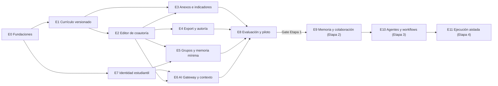

# Grafo de dependencias de épicas

Fuente: [11 §3–4](../11-Roadmap-MVP.md).

```mermaid
flowchart LR
  E0["E0 Fundaciones"] --> E1["E1 Currículo versionado"]
  E0 --> E7["E7 Identidad estudiantil"]
  E1 --> E2["E2 Editor de coautoría"]
  E1 --> E3["E3 Anexos e indicadores"]
  E2 --> E3
  E2 --> E4["E4 Export y autoría"]
  E2 --> E5["E5 Grupos y memoria mínima"]
  E7 --> E5
  E7 --> E6["E6 AI Gateway y contexto"]
  E2 --> E6
  E3 --> E8["E8 Evaluación y piloto"]
  E4 --> E8
  E5 --> E8
  E6 --> E8
  E8 -->|"Gate Etapa 1"| E9["E9 Memoria y colaboración (Etapa 2)"]
  E9 --> E10["E10 Agentes y workflows (Etapa 3)"]
  E10 --> E11["E11 Ejecución aislada (Etapa 4)"]
```
