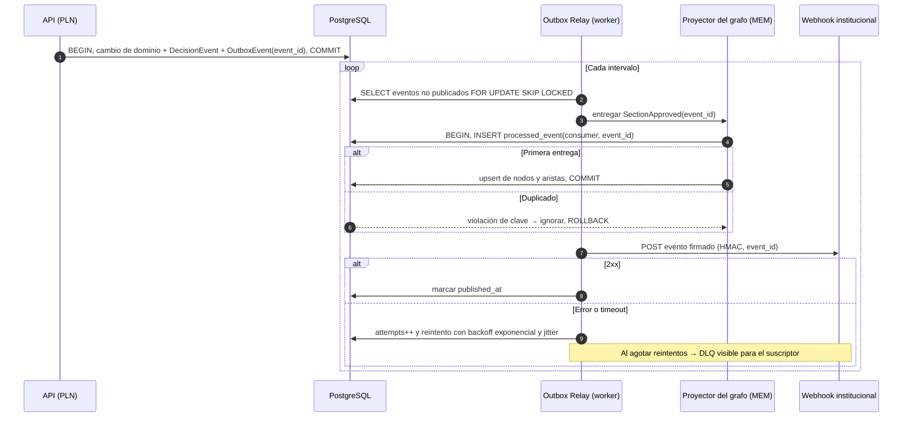

# Sequence — Outbox transaccional y consumidores idempotentes (R-09, R-10)

Fuente: [08 §3, R-09, R-10](../08-Concurrency-Consistency.md), [05 §10](../05-Technical-Specifications.md).

```mermaid
sequenceDiagram
  autonumber
  participant A as API (PLN)
  participant DB as PostgreSQL
  participant R as Outbox Relay (worker)
  participant K as Proyector del grafo (MEM)
  participant H as Webhook institucional

  A->>DB: BEGIN, cambio de dominio + DecisionEvent + OutboxEvent(event_id), COMMIT
  loop Cada intervalo
    R->>DB: SELECT eventos no publicados FOR UPDATE SKIP LOCKED
    R->>K: entregar SectionApproved(event_id)
    K->>DB: BEGIN, INSERT processed_event(consumer, event_id)
    alt Primera entrega
      K->>DB: upsert de nodos y aristas, COMMIT
    else Duplicado
      DB-->>K: violación de clave → ignorar, ROLLBACK
    end
    R->>H: POST evento firmado (HMAC, event_id)
    alt 2xx
      R->>DB: marcar published_at
    else Error o timeout
      R->>DB: attempts++ y reintento con backoff exponencial y jitter
      Note over R,H: Al agotar reintentos → DLQ visible para el suscriptor
    end
  end
```
