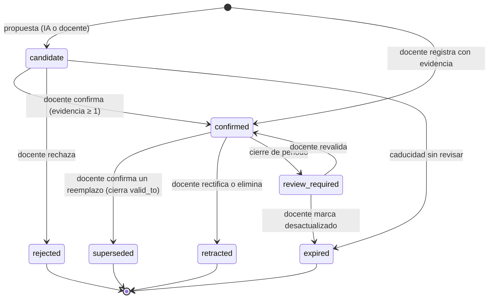

# State Machine — MemoryFact

Fuente: [03 §8](../03-Domain-Model-Pedagogy.md), INV-03, INV-04. Solo un docente autorizado produce `confirmed`.

```mermaid
stateDiagram-v2
  [*] --> candidate : propuesta (IA o docente)
  [*] --> confirmed : docente registra con evidencia
  candidate --> confirmed : docente confirma (evidencia ≥ 1)
  candidate --> rejected : docente rechaza
  candidate --> expired : caducidad sin revisar
  confirmed --> superseded : docente confirma un reemplazo (cierra valid_to)
  confirmed --> retracted : docente rectifica o elimina
  confirmed --> review_required : cierre de periodo
  review_required --> confirmed : docente revalida
  review_required --> expired : docente marca desactualizado
  rejected --> [*]
  superseded --> [*]
  retracted --> [*]
  expired --> [*]
```
