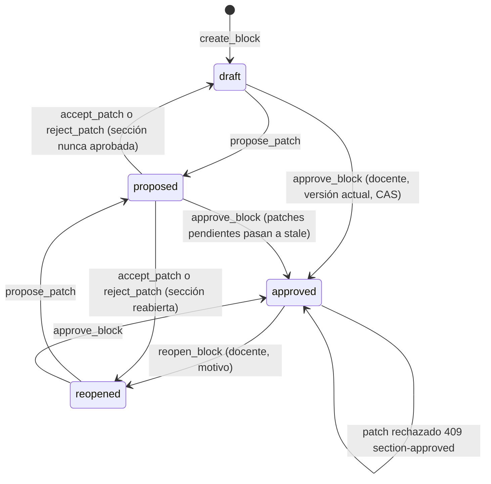

# State Machine — PlanSection

Fuente: [03 §3.3](../03-Domain-Model-Pedagogy.md), INV-01, INV-02. La versión reemplazada de una sección queda `superseded`.

```mermaid
stateDiagram-v2
  [*] --> draft : create_block
  draft --> proposed : propose_patch
  proposed --> draft : accept_patch o reject_patch (sección nunca aprobada)
  draft --> approved : approve_block (docente, versión actual, CAS)
  proposed --> approved : approve_block (patches pendientes pasan a stale)
  approved --> reopened : reopen_block (docente, motivo)
  reopened --> proposed : propose_patch
  proposed --> reopened : accept_patch o reject_patch (sección reabierta)
  reopened --> approved : approve_block
  approved --> approved : patch rechazado 409 section-approved
```
