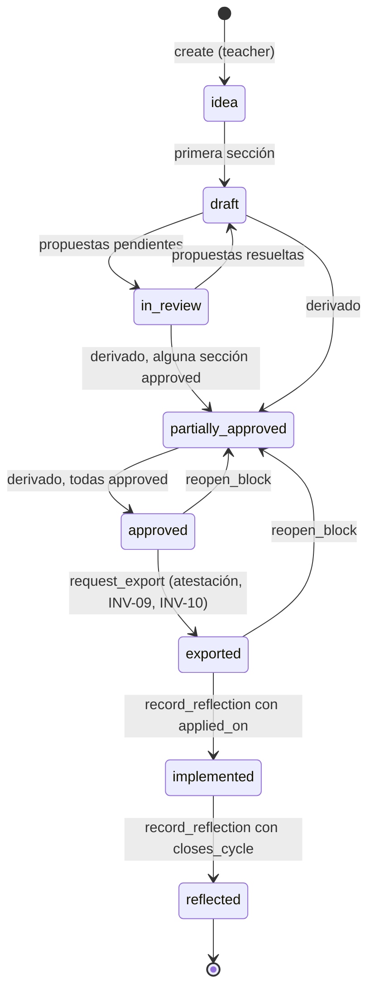

# State Machine — LessonPlan

Fuente: [03 §3.2](../03-Domain-Model-Pedagogy.md). `partially_approved` y `approved` se derivan del estado de las secciones; el resto se fija con eventos explícitos.

```mermaid
stateDiagram-v2
  [*] --> idea : create (teacher)
  idea --> draft : primera sección
  draft --> in_review : propuestas pendientes
  in_review --> draft : propuestas resueltas
  in_review --> partially_approved : derivado, alguna sección approved
  draft --> partially_approved : derivado
  partially_approved --> approved : derivado, todas approved
  approved --> partially_approved : reopen_block
  approved --> exported : request_export (atestación, INV-09, INV-10)
  exported --> partially_approved : reopen_block
  exported --> implemented : record_reflection con applied_on
  implemented --> reflected : record_reflection con closes_cycle
  reflected --> [*]
```
