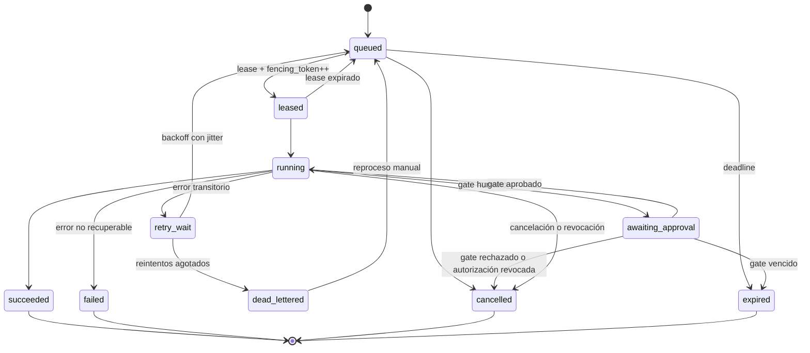

# State Machine — Task

Fuente: [07 §4](../07-AI-Agentic-Architecture.md), [08 R-05, R-07](../08-Concurrency-Consistency.md).

```mermaid
stateDiagram-v2
  [*] --> queued
  queued --> leased : lease + fencing_token++
  queued --> cancelled
  queued --> expired : deadline
  leased --> running
  leased --> queued : lease expirado
  running --> awaiting_approval : gate humano
  awaiting_approval --> running : gate aprobado
  awaiting_approval --> cancelled : gate rechazado o autorización revocada
  awaiting_approval --> expired : gate vencido
  running --> retry_wait : error transitorio
  retry_wait --> queued : backoff con jitter
  retry_wait --> dead_lettered : reintentos agotados
  dead_lettered --> queued : reproceso manual
  running --> succeeded
  running --> failed : error no recuperable
  running --> cancelled : cancelación o revocación
  succeeded --> [*]
  failed --> [*]
  cancelled --> [*]
  expired --> [*]
```
